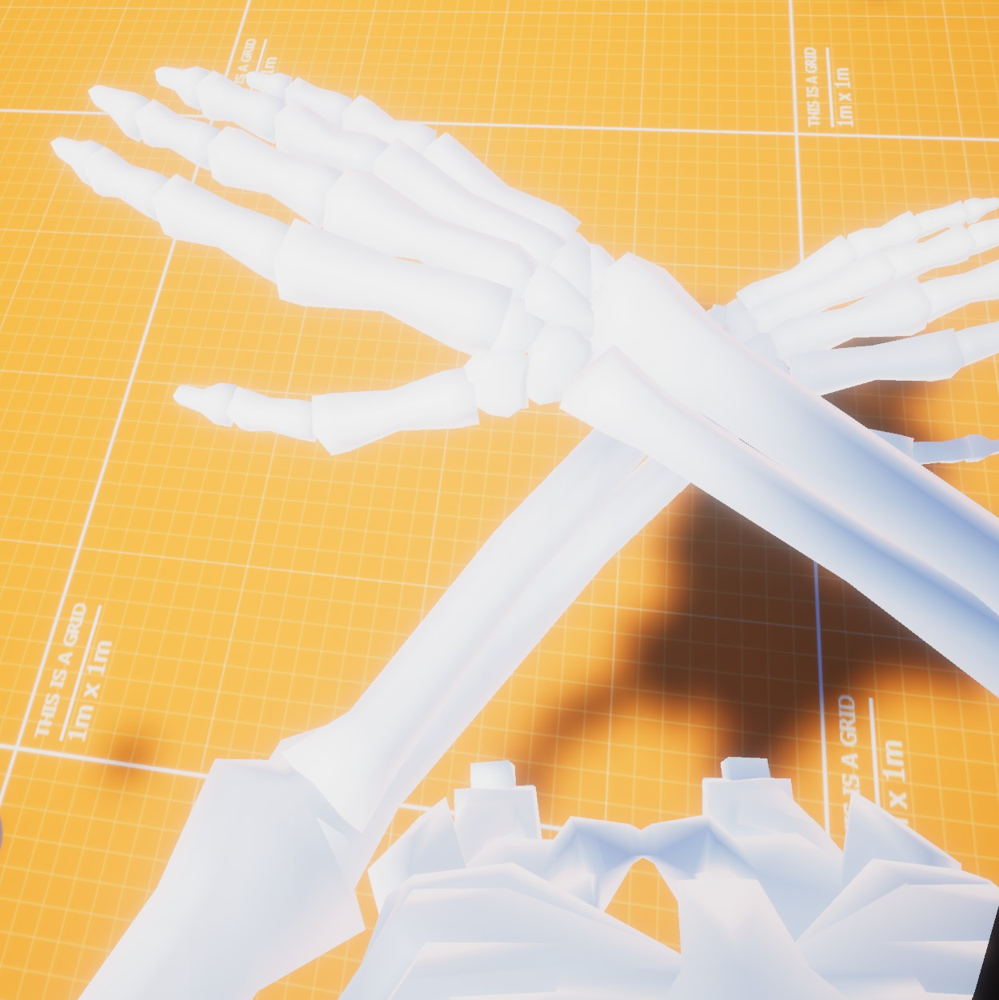
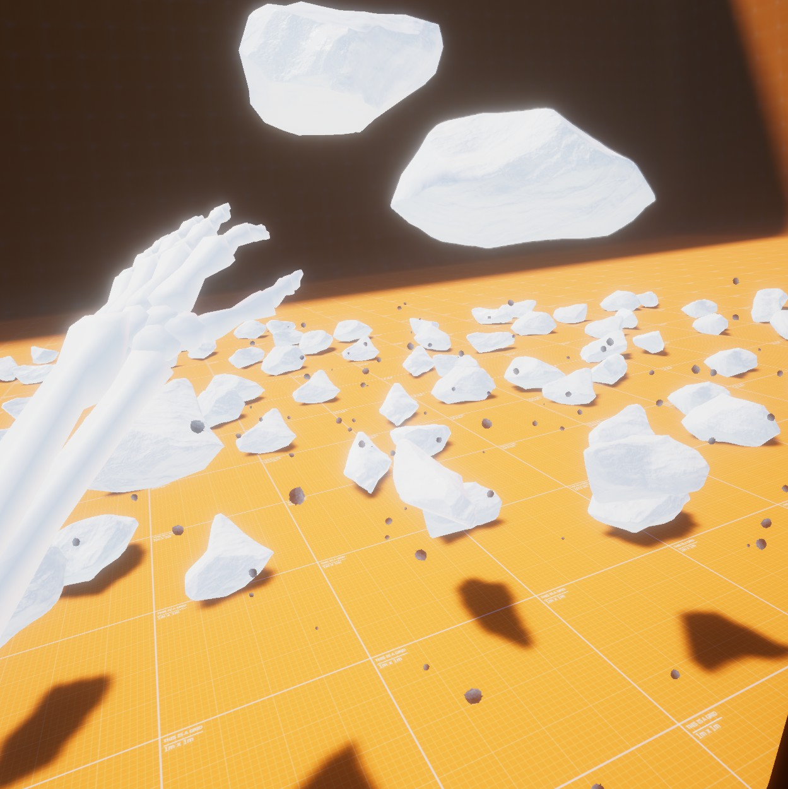
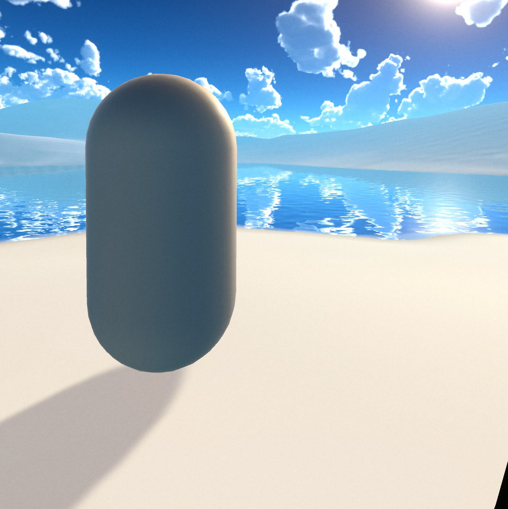
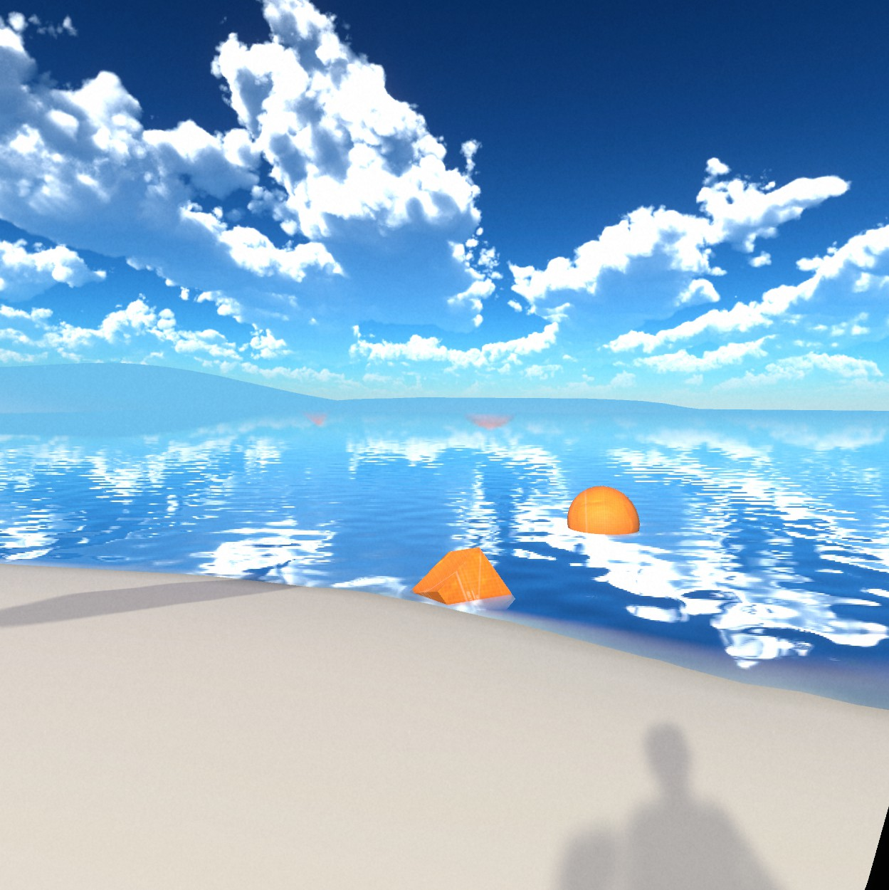

# VR control prototype
This is a VR prototype I made throughout 2020. I experimented with full humanoid rigs, inverse kinematics, gesture controls, and shaders.

## Gesture controls:

Standing near some rocks on the ground, point the palm of either of your hands downward, and then sharply move your hand upward. This should cause the rocks around you to begin floating.

Point your palm in the direction you would like the throw the rocks, and then thrust your hand in that direction. The floating rocks should go flying.

# What makes this project interesting:

I didn't like how many VR games that give the player arms and a torso have trouble posing these body parts in ways that aren't annoying or weird looking. I generally associate VR with elbows and arms clipping into torsos and torsos getting in the way when bending down to grab something off the floor. I wanted to try fixing the arms in this project and think it turned out pretty well.

The arm IK script splits the area around the player's torso into a handful of different zones. As the player's hands transition out of one of these zones and into another, the position for their elbow pull will move.

For example, if the player's left hand moves infront of their torso, it no longer makes sense for the that arm's elbow pull to be behind the player as this will cause the player's arm to clip through their torso to get to where the hand is located. Instead, the zone in front of the player's torso causes that arm's elbow pull to move forward and to the side, causing the player's arm to wrap around their torso instead of just passing through it.

There are a number of zones like this. If the player's arms are behind their back, the elbow pull will move back, up, and to the side so their arms will sort of wrap around the torso from the shoulder to the location the hand is located at. This is less weird looking because -- similar to when your hands are infront of you -- when you reach behind your back your elbows don't really stay in-line with your hands. They'll stick out to your sides.

The elbow pulls movement between different positions isn't a jarring snap as the hand passes from one zone to another. The elbow pull will be influenced by more than one relitive position at once with the weight of these infuences being how far into each zone the hand is. If the hand is located on the boarder between two zones, the elbow pull will locate itself between the two positions associated with those zones.

The elbow pull does not just move between fixed positions depending on what zone the hand is in. It dynamically picks a position between the hand and the shoulder, and is offset differently depending on which zone the hand is in. For example, if the hand is out to the side of the torso, the torso pull will be located between the hand and the shoulder, and then offset backwards behind the character.

If I were to improve on this now, I would make it so the rotation of the hands also slightly influences the elbow pull, since sometimes the hands can angle themselves in a way that looks unatural or uncomfortable for the wrist.

The torso's rotation is also interesting. In other VR games, having items like spare ammo magazines for guns attacked to the torso can be annoying because when the player looks down the movement of the torso can be unpredictable. In many games, the Y rotation of the torso will match the rotation of the head making it hard to turn your head to see the side of your own torso to grab something like a holstered weapon. In this prototype, the torso's rotation of the Y-axis is decided by the average of the head and the two hands making it much more stable and more likely to be facing where the player's real torso is actually facing.

# Screenshots

